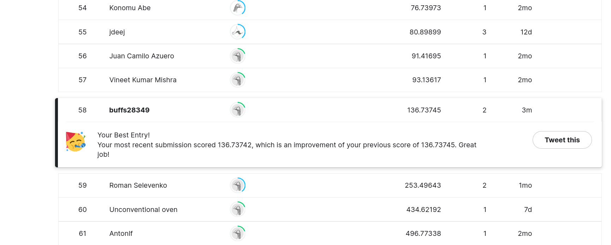

# Week 5: Monet Painting GAN - Kaggle Mini-Project
## Introduction
The goal of this week's mini-project is to compete in the Kaggle competition [I’m Something of a Painter Myself](https://www.kaggle.com/competitions/gan-getting-started/overview) by using Generative Adversarial Networks (GANs) to generate art in the style of the painter [Claude Monet](https://en.wikipedia.org/wiki/Claude_Monet).

GANs are composed of at least a generator model and a disciminator model, where the generator tries to "trick" the discriminator by producing images that essentially impersonate the training data (*i.e.* confusing its ability to classify real vs generated images).

The quality of our generated images are evaluated according to Memorization-informed Fréchet Inception Distance (MiFID). **Our goal is to achieve the smallest MiFID with the images our GAN produces.**

The code for this project can be found at: https://github.com/buffs28349/MonetPaintingGAN

## Leaderboard

